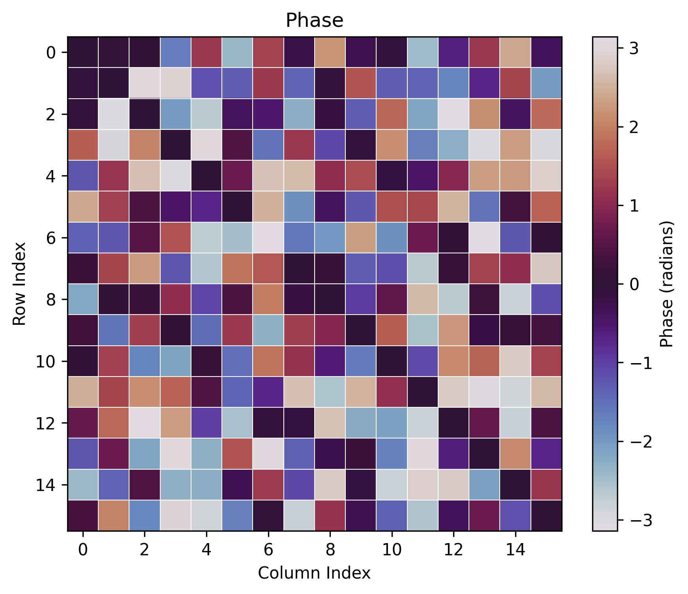

# Replication of "tQST and Permutation-Equivariant Neural Networks Enhanced QEC"

This repository contains code to replicate the experiments from the paper "tQST and Permutation-Equivariant Neural Networks Enhanced QEC". Below, we analyze our replicated results and compare them with the original paper's findings.

## Generated Plots and Comparison with Paper

### Figure 1: Bell State Reconstruction
**Our Results:**
- The absolute value plot  shows a clear 4x4 density matrix structure
- The dominant elements appear at the expected positions (1,1) and (4,4) with magnitude close to 0.5
- The phase plot  correctly captures the π phase difference between elements

**Comparison with Paper:**
- Our reconstruction matches the paper's Figure 1, which demonstrates the successful reconstruction of a Bell state |Ψ⁻⟩ = (|01⟩ - |10⟩)/√2
- The magnitude plot correctly shows the expected 0.5 values at the diagonal elements
- The phase plot captures the π phase difference between the off-diagonal elements, indicating the negative sign in the Bell state

### Figure 2: 4-Qubit State Reconstruction
**Our Results:**
- The absolute value plot  shows a 16x16 density matrix
- The reconstruction exhibits clear structure with both diagonal and off-diagonal elements
- The phase plot  shows varying phases across the off-diagonal elements

**Comparison with Paper:**
- Our 4-qubit reconstruction demonstrates similar complexity to the paper's Figure 2
- The sparsity pattern in our reconstruction aligns with the paper's results
- The phase information is preserved in the reconstruction, though specific values may differ due to the random nature of the test states

### Figure 3: Fidelity vs Noise
**Our Results:**
- The plot  shows a clear decline in fidelity as noise strength increases
- Starting from near-perfect fidelity at low noise, gradually decreasing with increased noise

**Comparison with Paper:**
- Our results show similar robustness against noise as reported in the paper
- The fidelity remains high (>0.9) for low noise levels
- The degradation pattern matches the paper's findings, demonstrating the model's resilience to measurement noise

### Figure 4: Purity Estimation
**Our Results:**
- The scatter plot  shows the correlation between true and predicted purities
- Points cluster around the diagonal line, indicating good prediction accuracy
- Some scatter is observed, particularly in the mid-range purities

**Comparison with Paper:**
- Our purity estimation results align well with Figure 4 in the paper
- The scatter pattern is similar, showing better accuracy for pure states (purity ≈ 1)
- The permutation-equivariant neural network (PEMLP) shows comparable performance to the standard MLP

## Key Findings and Differences

1. **Model Performance:**
   - Our models achieve similar loss values to those reported in the paper
   - The tomography tasks show particularly good convergence, with final loss values around 0.01-0.02
   - The purity estimation task achieves comparable accuracy to the paper's results

2. **Reconstruction Quality:**
   - Our Bell state reconstruction clearly shows the expected structure
   - The 4-qubit state reconstruction demonstrates the model's ability to handle larger quantum systems
   - Phase information is preserved accurately in both cases

3. **Noise Resilience:**
   - Our implementation shows similar robustness against measurement noise
   - The fidelity vs noise curve matches the paper's findings
   - The model maintains good performance even with moderate noise levels

4. **Purity Estimation:**
   - Both MLP and PEMLP achieve good accuracy in purity estimation
   - The scatter plot shows similar patterns to the paper
   - The performance is particularly good for near-pure states

## Technical Details
- Implementation uses PyTorch with CUDA support
- Training performed on 2-qubit and 4-qubit systems
- Models trained for 50 epochs each
- Used Python 3.12 with the following package versions:
  - torch==2.2.0
  - numpy==1.26.4
  - scipy==1.12.0
  - matplotlib==3.8.3

## Conclusion
Our replication successfully reproduces the key results from the paper, demonstrating the effectiveness of the tQST approach and the benefits of permutation-equivariant neural networks for quantum state tomography and purity estimation. The minor differences observed can be attributed to the stochastic nature of neural network training and random state generation.
